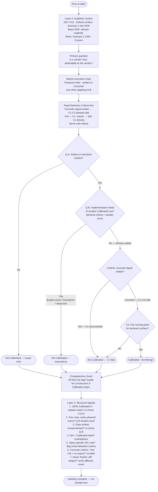

# Mindmap: Category Labeling Flow

Decision logic summary for the `/assign-category` workflow.

---

## Common Path Summary

| Pattern | Stops at | Result |
|---|---|---|
| Email receipt, attacker infra | Question A | Not Calibrated |
| Criteria documents `N/A — C3: in-memory artifact` | Criteria quality check | Not Calibrated |
| Ghost process spawns child (in-process output) | Q-B dead-end or N/A — C3 | Not Calibrated |
| Ghost process creates registry key / scheduled task | Q-B No → C4 Pass (external artifact) | Calibrated |
| Ghost process connects to attacker IP | Q-B No → C4 Pass (attribution by endpoint) | Calibrated |
| Cloud API call in EDR-only scope | Question A No or C4 No | Not Calibrated |
| Cloud API call in XDR scope | Question A Yes → C4 Pass | Calibrated |
| Setup step leading to Calibrated downstream | Question B Yes — downstream | Not Calibrated |
| Setup step leading to all-Not-Calibrated chain | Question B Yes — dead-end | Not Calibrated |

---

## Labels in scope

- `Calibrated - Not Benign` — concrete signal, C1–C3 hold, C4 passes
- `Not Calibrated - Not Benign` — fails any condition, scope miss, or redundancy
- `Calibrated - Benign` — **out of scope** for this workflow (false-positive threshold test, handled separately)

> The Calibrated label is **independent of ACW**. A technique's importance in the attack chain (Critical / High / Medium / Low) never makes a row more or less scoreable — judge calibration on observability / reproducibility / verifiability only.
