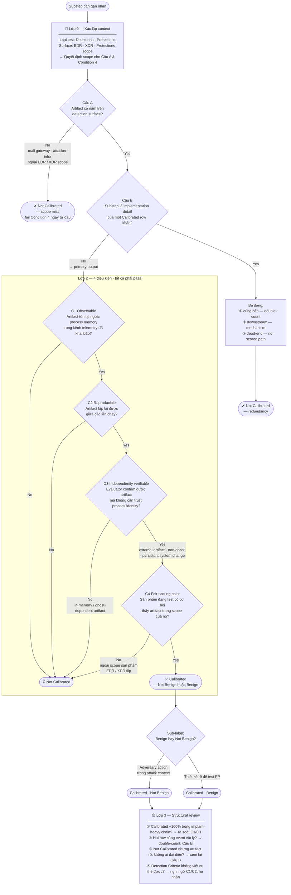

# Mindmap: Luồng gán nhãn Category

Diagram tóm tắt logic ra quyết định của `skills/category-assignment.md`.

---

## Tóm tắt path thường gặp

| Pattern | Dừng tại | Kết quả |
|---|---|---|
| Email receipt, attacker infra | Câu A | Not Calibrated |
| Ghost process spawn child (in-process output) | Câu B dead-end hoặc C3 | Not Calibrated |
| Ghost process tạo registry key / scheduled task | Câu B No → Lớp 2 C3 **Pass** (external artifact) | Calibrated |
| Ghost process connect attacker IP | Câu B No → C3 **Pass** (attribution by endpoint) | Calibrated |
| Cloud API call trong EDR-only scope | Câu A No hoặc C4 No | Not Calibrated |
| Cloud API call trong XDR scope | Câu A Yes → Lớp 2 → **Pass** | Calibrated |
| Setup step dẫn đến Calibrated downstream | Câu B Yes — downstream | Not Calibrated |
| Setup step dẫn đến chain toàn Not Calibrated | Câu B Yes — dead-end | Not Calibrated |
