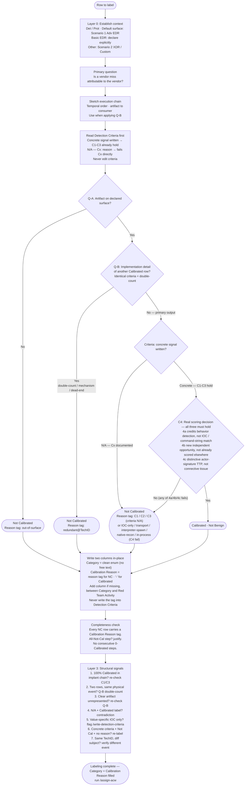

# Mindmap: Category Labeling Flow

Decision logic summary for the `/assign-category` workflow.

> **Đọc nhanh (tiếng Việt):** sơ đồ dưới đây là toàn bộ logic quyết định của skill `/assign-category` — gán nhãn `Calibrated` / `Not Calibrated` cho từng dòng trong Reference Table. Nhãn `Calibrated` nghĩa là *dòng này được tính vào mẫu số của tỷ lệ phát hiện*; `Not Calibrated` nghĩa là *không tính điểm* (vì là bước setup, chi tiết triển khai, trùng lặp, hay nằm ngoài bề mặt đo). Phần **"Giải thích chi tiết luồng"** ngay sau sơ đồ đi qua từng node và *lý do* của nó. Nhãn node giữ tiếng Anh để mermaid render khớp với SKILL.md; thuật ngữ kỹ thuật (C1–C4, các tag) cũng giữ nguyên để không lệch nguồn.

---

## Giải thích chi tiết luồng

Câu hỏi xuyên suốt toàn sơ đồ: **"Nếu sản phẩm bỏ sót tín hiệu này, lỗi đó có quy được cho nhà cung cấp không?"** Mọi node bên dưới chỉ là cách trả lời câu hỏi đó một cách có hệ thống.

### `L0` — Layer 0: Xác lập bối cảnh
Trước khi gán nhãn bất kỳ dòng nào, phải biết đang đo trên **bề mặt telemetry nào**, vì cùng một hành vi có thể Calibrated ở bề mặt này nhưng Not Calibrated ở bề mặt khác.
- Mặc định là **Scenario 1 (EDR)** — bề mặt nâng cao đầy đủ (process tree, file I/O, registry, netconn, quét bộ nhớ, ETW injection, giám sát native API…). Không cần khai báo gì thêm.
- **Basic EDR** phải khai báo *tường minh* — chỉ khi cuộc đánh giá cố ý nhắm vào sản phẩm không có năng lực giám sát in-memory/injection.
- Khác nữa: **Scenario 2 (XDR)** hoặc **Custom** (phải liệt kê kênh telemetry rõ ràng).
*Vì sao quan trọng:* một API call lên cloud là Not Calibrated trong phạm vi chỉ-EDR nhưng lại Calibrated trong phạm vi XDR — khác biệt nằm hoàn toàn ở Layer 0.

### `PQ` — Primary question (câu hỏi chủ đạo)
Không phải một node "tính toán" mà là **kim chỉ nam**: lỗi bỏ sót có *attributable* (quy trách nhiệm được) cho nhà cung cấp không? Conditions 1–3 phía dưới chỉ kiểm tra điều kiện *làm cho lỗi quy được* (artifact ổn định, kiểm chứng độc lập). Condition 4 mới là quyết định *thiết kế đánh giá* — có công bằng để chấm điểm không.

### `SKETCH` — Phác chuỗi thực thi
Vẽ các substep theo **thứ tự thời gian**, ghi rõ mỗi bước *tạo ra* artifact gì và bước nào *tiêu thụ* nó. Bản đồ này dùng cho **Q-B** (kiểm tra trùng lặp). Một dòng chỉ là "chi tiết triển khai" khi bản đồ cho thấy một dòng Calibrated phía dưới **chứng minh trực tiếp** rằng dòng này đã chạy — chứ không chỉ vì nó nằm phía trên.

### `READ` — Đọc Detection Criteria TRƯỚC
Đây là bất biến cốt lõi: **đọc bằng chứng, không tưởng tượng**.
- Có **tín hiệu cụ thể** đã viết sẵn → nghĩa là Conditions 1–3 (Observable / Reproducible / Verifiable) *đã thỏa* trên thực tế — không cần suy diễn lại.
- Có ghi `N/A — Cx: <lý do>` → tức là điều kiện Cx *trượt thẳng*, dòng này Not Calibrated trên đúng điều kiện đó.
- **Không bao giờ sửa cột criteria** — nó là bằng chứng thượng nguồn, do `write-detection-criteria` sở hữu.

### `QA` — Question A: Artifact có nằm trên bề mặt khai báo?
Kiểm tra **phạm vi** (scope), độc lập với chất lượng tín hiệu. Nếu artifact rơi ra ngoài bề mặt đã khai báo ở Layer 0 → **Not Calibrated**, tag `out-of-surface`. Ví dụ: email nhận, hạ tầng của kẻ tấn công, hay cloud API call khi phạm vi chỉ là EDR.

### `QB` — Question B: Có phải chi tiết triển khai của một dòng Calibrated khác?
Kiểm tra **trùng lặp** (redundancy). Dấu hiệu kinh điển của double-count: **hai dòng mang criteria y hệt nhau**. Nếu đúng → giữ một dòng Calibrated, dòng kia **Not Calibrated**, tag `redundant@<TechID>`. Bao gồm cả hai ca: bước setup dẫn tới một dòng Calibrated phía dưới, *và* bước setup dẫn tới một nhánh toàn-Not-Calibrated (dead-end). Nếu không trùng → đây là *primary output*, đi tiếp.

### `CRITQ` — Cổng chất lượng criteria
- `N/A — Cx documented` → trượt ngay ở C1/C2/C3, **Not Calibrated** với tag điều kiện tương ứng.
- Có **tín hiệu cụ thể** (C1–C3 thỏa) → đủ điều kiện, chuyển sang C4.
*Lưu ý quan trọng:* "có tín hiệu sạch" **chưa phải** Calibrated. `netstat`, `ipconfig`, tải tool, `PsExec` đều qua C1–C3 hoàn hảo nhưng vẫn Not Calibrated — vì quyết định thật nằm ở C4.

### `C4` — Quyết định chấm điểm thật (cả ba phải đúng)
Đây là trái tim của toàn bộ logic. Một dòng đủ điều kiện chỉ thành Calibrated khi đồng thời:
- **4a** — chấm là chấm việc *phát hiện hành vi*, không phải khớp IOC / chuỗi lệnh.
- **4b** — là *cơ hội phát hiện mới, độc lập*, chưa được dòng nào khác đảm bảo. Ví dụ: exfil qua kênh *mới* = Calibrated; exfil qua C2 *đã có* = Not Calibrated.
- **4c** — là *TTP đặc trưng chữ ký actor*, không phải "mô liên kết" chung chung (delivery, transport/T1105, spawn interpreter, recon native, plumbing remote-exec, staging thuần).

Trượt *bất kỳ* điều nào trong 4a/4b/4c → **Not Calibrated** (tag `IOC-only` / `transport` / `interpreter-spawn` / `native-recon` / `staging` / `in-process`…). Đây là các "prior có thể bác bỏ": cùng một technique có thể **lật nhãn theo vai trò** trong bước (rar để staging vs rar+exfil là mục tiêu).

### `CAL` / `NCL2` / `NC_A` / `NC_B` → `WRITE` — Ghi kết quả
Mọi nhánh kết thúc đều hội tụ về node `WRITE`: ghi **hai cột** tại chỗ trong Phase file.
- `Category` = enum sạch (không văn bản tự do) để lọc/đếm được.
- `Calibration Reason` = tag lý do cho dòng NC, `-` cho dòng Calibrated. Nếu bảng cũ thiếu cột này, chèn vào *giữa* `Category` và `Red Team Activity`.
- **Tuyệt đối không** ghi tag vào `Detection Criteria`.
*Vì sao tách tag riêng:* lý do được ghi lại quan trọng hơn cái nhãn — khi heuristic đổi, có thể *suy lại nhãn từ tag* mà không phân tích lại từ đầu; và một cú lật nhãn theo vai trò chỉ hợp lệ khi tag giải thích được nó.

### `COMP` — Kiểm tra đầy đủ
- Mọi dòng NC **phải** mang một tag `Calibration Reason`.
- Bước nào *toàn bộ* dòng đều Not Calibrated thì phải có lý do biện minh (thường chính các tag đã cung cấp).
- Không để hai bước liên tiếp 0-Calibrated mà không có lý do ghi rõ.

### `L3` — Layer 3: Tín hiệu cấu trúc (bắt lỗi gán nhãn)
Bảy kiểm tra chéo bắt các mẫu sai phổ biến, ví dụ: 100% Calibrated trong chuỗi implant (đáng ngờ → soi lại C1/C3); hai dòng cùng một sự kiện vật lý (double-count → Q-B); nhãn `Calibrated` đi kèm criteria `N/A` (mâu thuẫn); criteria chỉ là IOC theo giá trị cụ thể (cần gắn cờ về `write-detection-criteria`).

### `HANDOFF` — Bàn giao
Khi `Category` + `Calibration Reason` đã điền đủ, gán nhãn là **pass nội dung per-row cuối cùng**. Bàn giao sang `/assign-acw` để chấm trọng số chuỗi tấn công (trục độc lập — xem ghi chú cuối file).

---

## Common Path Summary

> **Bảng ca thường gặp:** mỗi dòng là một mẫu hành vi điển hình, *node nó dừng lại* trong sơ đồ, và *kết quả nhãn*. Dùng như bộ đối chiếu nhanh — nếu một dòng thực tế khớp một mẫu ở đây, kết quả thường đã rõ mà không cần đi lại toàn bộ luồng. Lưu ý hai cặp đối lập minh họa vai trò Layer 0 và C4: cùng "ghost process tạo registry/netconn" thì Calibrated (có artifact ngoài, quy được cho endpoint), còn "ghost process spawn con" thì Not Calibrated (in-process, không kiểm chứng được); cùng "cloud API call" thì Not Calibrated trong EDR-only nhưng Calibrated trong XDR.

| Pattern | Stops at | Result |
|---|---|---|
| Email receipt, attacker infra | Question A | Not Calibrated |
| Criteria documents `N/A — C3: in-memory artifact` | Criteria quality check | Not Calibrated |
| Ghost process spawns child (in-process output) | Q-B dead-end or N/A — C3 | Not Calibrated |
| Ghost process creates registry key / scheduled task | Q-B No → C4 Pass (external artifact) | Calibrated |
| Ghost process connects to attacker IP | Q-B No → C4 Pass (attribution by endpoint) | Calibrated |
| Cloud API call in EDR-only scope | Question A No or C4 No | Not Calibrated |
| Cloud API call in XDR scope | Question A Yes → C4 Pass | Calibrated |
| Setup step leading to Calibrated downstream | Question B Yes — downstream | Not Calibrated |
| Setup step leading to all-Not-Calibrated chain | Question B Yes — dead-end | Not Calibrated |

---

## Labels in scope

> **Các nhãn trong phạm vi:** chỉ hai nhãn được skill này dùng — `Calibrated - Not Benign` (tín hiệu cụ thể, C1–C3 thỏa, C4 qua) và `Not Calibrated - Not Benign` (trượt một điều kiện bất kỳ, sai phạm vi, hoặc trùng lặp). Nhãn `Calibrated - Benign` (bài kiểm tra ngưỡng false-positive) **nằm ngoài phạm vi** và được xử lý riêng. Hai ghi chú phía dưới là hai bất biến quan trọng nhất: (1) output là **hai cột** chứ không phải một, và (2) nhãn calibration **độc lập hoàn toàn với ACW** (độ quan trọng trong chuỗi không bao giờ khiến một dòng dễ/khó chấm điểm hơn).

- `Calibrated - Not Benign` — concrete signal, C1–C3 hold, C4 passes
- `Not Calibrated - Not Benign` — fails any condition, scope miss, or redundancy
- `Calibrated - Benign` — **out of scope** for this workflow (false-positive threshold test, handled separately)

> Output is **two columns**, not one: `Category` (the clean enum above) and `Calibration Reason` (a reason tag for every Not-Calibrated row, `-` for Calibrated). Tag vocabulary: `out-of-surface` / `redundant@<TechID>` / `transport` / `interpreter-spawn` / `native-recon` / `staging` / `in-process` / `IOC-only` / `C1`\|`C2`\|`C3`. The recorded reason matters more than the label — it lets the label be re-derived when the heuristic changes. Never write the tag into `Detection Criteria` (off-limits); for a C1–C3 failure the detail already lives there as `N/A — <Cx>`, just mirror the short tag here.

> The Calibrated label is **independent of ACW**. A technique's importance in the attack chain (Critical / High / Medium / Low) never makes a row more or less scoreable — judge calibration on observability / reproducibility / verifiability only.
