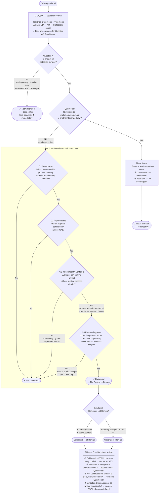

# Mindmap: Category Labeling Flow

Decision logic summary for `guides/category-assignment.md`.

---

## Common Path Summary

| Pattern | Stops at | Result |
|---|---|---|
| Email receipt, attacker infra | Question A | Not Calibrated |
| Ghost process spawns child (in-process output) | Question B dead-end or C3 | Not Calibrated |
| Ghost process creates registry key / scheduled task | Question B No → Layer 2 C3 **Pass** (external artifact) | Calibrated |
| Ghost process connects to attacker IP | Question B No → C3 **Pass** (attribution by endpoint) | Calibrated |
| Cloud API call in EDR-only scope | Question A No or C4 No | Not Calibrated |
| Cloud API call in XDR scope | Question A Yes → Layer 2 → **Pass** | Calibrated |
| Setup step leading to Calibrated downstream | Question B Yes — downstream | Not Calibrated |
| Setup step leading to all-Not-Calibrated chain | Question B Yes — dead-end | Not Calibrated |
