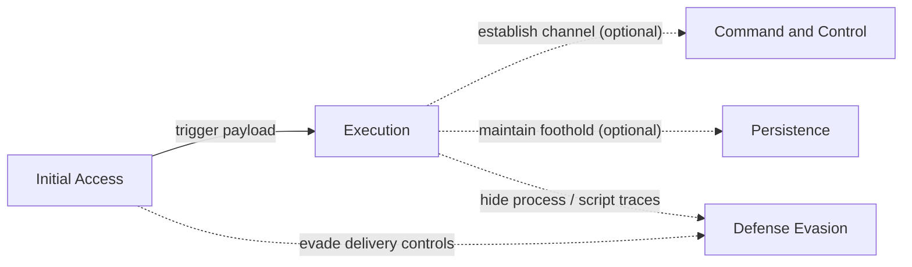
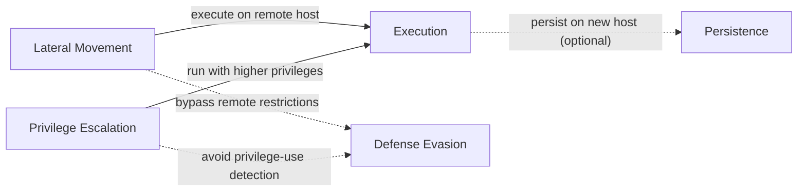
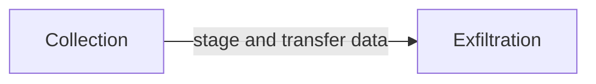
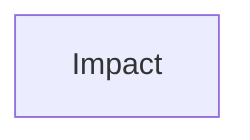

# Attack Chain Templates

Reference templates for common attack chain patterns. Since the specific MITRE ATT&CK Evaluation scenarios have not been fully published, these templates are drawn from observed past scenarios to help predict likely cases from the published technique list.

## Phase 1

## Phase 2

Phase 2 output: discovered hosts, services, trust paths, and credentials become operational input for later expansion.

## Phase 3

Phase 3 input: use Phase 2 findings to choose lateral paths, target privileged accounts, and execute on remote systems.

## Phase 4

## Phase 5

