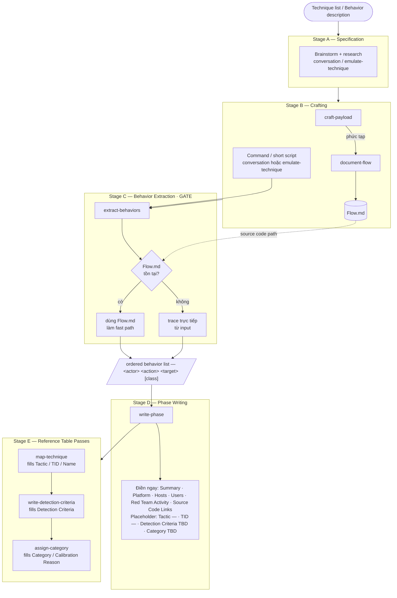
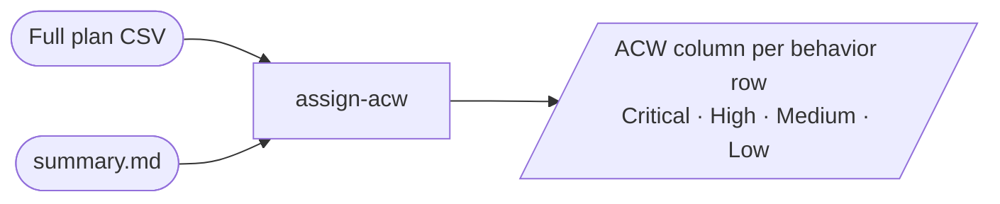

# Skill Workflow — Vai trò và luồng chạy

Hai luồng tách biệt: **Procedure-Crafting Loop** (chạy lặp theo từng technique/behavior) và **Scoring Pass** (chạy một lần sau khi toàn bộ plan hoàn chỉnh).

---

## Procedure-Crafting Loop

---

## Scoring Pass

Chạy độc lập một lần sau khi toàn bộ plan hoàn chỉnh — không thuộc procedure-crafting loop.

---

## Skill Reference

| Skill | Vai trò | Stage |
|---|---|---|
| `emulate-technique` | Khảo sát variant kỹ thuật, đề xuất hướng triển khai | A / B |
| `craft-payload` | Build và verify payload (Go / Python / C# / PowerShell) | B |
| `document-flow` | Trace source code → `Flow.md` (behavior list + artifact map + produces→consumes) | B — complex payload only |
| `extract-behaviors` | Chuyển mọi input thành ordered atomic behavior list; check `Flow.md` trước nếu input là source code | C |
| `write-phase` | Viết Phase file skeleton từ behavior list | D |
| `map-technique` | Điền Tactic / Technique ID / Technique Name vào Reference Table | E |
| `write-detection-criteria` | Viết Detection Criteria cho mọi row | E |
| `assign-category` | Gán Calibrated / Not Calibrated bằng cách đọc Detection Criteria | E |
| `assign-acw` | Gán ACW (chain-role weight) per behavior trên toàn bộ plan CSV | Scoring — độc lập |
