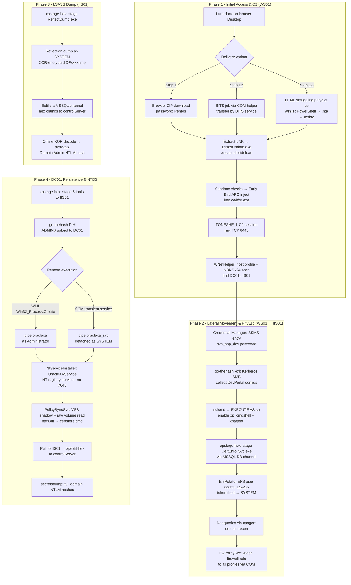

# Q3 Plan - Scenario Summary

**Adversary archetype:** Mustang Panda-style PRC espionage operator  
**Objective:** Gain persistent, covert access to a Windows enterprise domain; exfiltrate a full Active Directory credential dump  
**Lab topology:** Attacker (192.168.56.2) → WS01 (10.12.10.30) → IIS01 (10.12.10.20) → DC01 (10.12.10.10)

---

## Attack Chain Overview

The scenario proceeds in four phases across three hosts. Each phase builds directly on the access established in the one before it.

```
Attacker ──[TONESHELL C2]──► WS01 ──[Kerberos SMB / MSSQL]──► IIS01 ──[SMB PtH / named pipe]──► DC01
             Phase 1              Phase 2 + 3 (LM / LSASS)            Phase 4
```



---

## Phase 1 - Initial Access and C2 Establishment (WS01)

The adversary delivers a lure document (`Braavos_Competitiveness_Brief.docx`) to `labuser`'s desktop on `WS01`. The document contains an embedded hyperlink pointing to an adversary-controlled staging server. When `labuser` clicks the link, a password-protected ZIP is downloaded. Extracting it reveals an LNK file disguised as a document - double-clicking it fires a renamed Microsoft debug binary, which loads an attacker-controlled DLL from the same directory via Windows DLL search order.

As a delivery variant (Step 1B), the same archive can instead be pulled through the Windows Background Intelligent Transfer Service: a small unsigned C# helper (`BitsDownloader.exe`) enqueues a BITS job via the BITS COM API, and the signed BITS service (`svchost.exe -k netsvcs -s BITS`) performs the HTTP transfer and writes the ZIP - hiding the download behind a trusted Microsoft process (`T1197 - BITS Jobs`).

As a second delivery variant (Step 1C), the lure's hyperlink instead opens an adversary HTML page that smuggles the payload entirely client-side: the page carries a base64 blob that the browser reassembles into a polyglot `Essos_Compliance_Update.cer` in the user's `Downloads\` folder - the `.cer` is never served, so no HTTP download of it appears in network telemetry (`T1027.006 - HTML Smuggling`). The page also pre-loads a PowerShell one-liner into the clipboard; `labuser` pastes it into the Run dialog (**Win+R**), and PowerShell base64-decodes the polyglot text into `%TEMP%\Essos_Compliance_Update.hta` (renamed from `.bin`), then hands it to `mshta.exe`. The HTA drops the loader (`EssosUpdate.exe` + `wsdapi.dll`) from embedded base64 and launches it with a hidden window. From that point the TONESHELL chain is identical to Step 1.

The DLL performs a series of environment checks before proceeding: it validates the host process name and polls foreground window changes to defeat sandboxes. Once satisfied, it decrypts an embedded shellcode payload, spawns `waitfor.exe` in a suspended state, and injects the shellcode into it via a shared-section Early Bird APC flow using direct syscalls that bypass userland hooks.

The shellcode - running inside `waitfor.exe` - collects the victim hostname, generates a per-implant GUID written to a masquerading config path in the user profile, and opens a raw TCP connection to the TONESHELL controller. A registration handshake is sent and the session enters an adaptive beacon loop.

With an active C2 session, the adversary profiles `WS01`: hostname, domain, OS version, session identity, running processes, installed services, local group memberships, and filesystem entries - all collected in-process by a dropped reconnaissance tool (`WNetHelper.exe`) with no child process spawned. The tool then sweeps the local `/24` subnet via NBNS, identifying `DC01` (10.12.10.10) as the domain controller and `IIS01` (10.12.10.20) as a domain-joined server. The scanner is deleted after output collection.

---

## Phase 2 - Lateral Movement, Collection, and Privilege Escalation (WS01 → IIS01)

The developer previously saved MSSQL credentials for `IIS01` in Windows Credential Manager via SSMS. Rather than the PowerShell `CredentialManager` module - its NuGet bootstrap is unavailable in the lab and `Get-StoredCredential` is a heavily signatured telemetry surface - the adversary pushes a small custom Go utility (`credvault.exe`) through the TONESHELL file-transfer channel (staged under the benign `.stl` extension, renamed to `.exe` just before execution). Because the implant already runs in `labuser`'s session, `credvault.exe` calls `CredEnumerateW` and `CredReadW` via advapi32 in one pass (`dump Microsoft:SSMS`) to recover the plaintext `svc_app_dev` password in-session - no offline cracking, no PowerShell or `cmdkey.exe` anywhere in the chain.

Before committing to the database channel, the adversary pivots laterally to IIS01 over SMB using the recovered `svc_app_dev` credentials. The `go-thehash.exe` toolkit - later reused for Pass-the-Hash in Phase 4 - is pushed to `WS01` through the TONESHELL file-transfer channel (staged as `go-thehash.stl`, renamed to `.exe` at the moment of use) and run with its `-krb` mode. Rather than a hash-based logon, the tool performs a genuine Kerberos authentication: it requests a TGT from `DC01`, obtains a service ticket for `cifs/iis01.testlab.local`, and establishes an authenticated SMB2 session to IIS01 - telemetry (`4768`/`4769` on the DC, a Kerberos network logon on IIS01) that Pass-the-Hash never generates. Authenticated as `svc_app_dev`, the tool tree-connects the `DevPortal` share and recursively collects every `*.config` and `*.json` file (`appsettings.json`, `web.config`), staging them under `C:\Windows\Temp\loot\` on WS01 before deleting the tool and the loot directory. This clears the collection objective for the application tier and confirms the domain account is valid before the adversary commits to the database path.

Using those credentials, the adversary authenticates to the MSSQL instance on `IIS01` via `sqlcmd`. The `svc_app_dev` login holds an `IMPERSONATE` privilege over the `sa` account - a misconfiguration in the DevPortalDB setup - which is exploited to switch execution context to `sa`. Under `sa`, the adversary enables `Ole Automation Procedures` and `xp_cmdshell`, giving OS-level command execution through `sqlservr.exe`. An in-database C2 agent (`xpagent`) is also installed: a DDL script creates tables, a Service Broker queue, and an activation procedure that routes operator commands through `xp_cmdshell` without requiring direct polling.

To escalate from the MSSQL service account to `NT AUTHORITY\SYSTEM`, the adversary stages an EfsPotato tool (`CertEnrollSvc.exe`) to `IIS01` entirely through the database: the binary is hex-encoded by the controlServer, chunked as NVARCHAR rows, bulk-inserted into `tempdb`, decoded via a T-SQL `CONVERT` call, and written to `C:\ProgramData\` by `ADODB.Stream` - masqueraded as `CertEnrollSvc.stl` at rest, then renamed to the original `.exe` via a COM `MoveFile` in the same batch - entirely in-process within `sqlservr.exe`, no PowerShell or `cmd.exe` spawn on `IIS01`.

The tool is launched directly via sp_OA, creating a named pipe and coercing LSASS to connect via the MS-EFSR RPC interface. When LSASS connects, its SYSTEM impersonation token is captured and duplicated, then used to spawn `cmd.exe` as `NT AUTHORITY\SYSTEM`. Privilege is confirmed and cleanup is performed under SYSTEM context (the output file is SYSTEM-owned, requiring a second escalation to delete it).

With SYSTEM confirmed, the adversary runs four Net queries through the xpagent channel to map the domain: group enumeration, Domain Admins membership, domain user list, and administrator account details - all dispatched inline with output returned without writing files to disk.

Before moving on, the adversary hardens the access it now depends on. The MSSQL listener rule on IIS01 was created scoped to the Domain firewall profile only, so any profile change on the host would silently sever the database channel every later phase relies on. Rather than reach for `netsh advfirewall` or the `NetFirewallRule` PowerShell cmdlets - exactly what mature detections key on - the adversary stages a purpose-built `FwPolicySvc.exe` through the same MSSQL database channel used for `CertEnrollSvc.exe`, and rewrites the rule's `Profiles` mask to `0x7FFFFFFF` (Domain + Private + Public) in-process via the `INetFwPolicy2` / `INetFwRules` COM API. The COM call lands with SYSTEM elevation through the EFS named-pipe chain, `netsh.exe` and `powershell.exe` never appear in the process tree, and the tool and its output are removed from disk under SYSTEM context in the same step.

---

## Phase 3 - Credential Access: LSASS Dump (IIS01)

With the database channel proven for tool delivery in Phase 2, the adversary uses the same mechanism to transfer a custom LSASS dump tool (`ReflectDump.exe`) to `IIS01`.

The EfsPotato escalation chain is re-used to spawn `ReflectDump.exe` as `NT AUTHORITY\SYSTEM` - again with no `cmd.exe` in the chain, going directly `CertEnrollSvc.exe → ReflectDump.exe`. Running as SYSTEM, the tool locates LSASS by process ID scan (avoiding the common Toolhelp32 API path), opens a handle using a reflection-specific access mask distinct from standard Mimikatz patterns, and forks a suspended reflection clone via `RtlCreateProcessReflection`. The full minidump is captured entirely into a 75 MB heap buffer via a memory-only I/O callback - no disk write at dump time. The heap buffer is XOR-encrypted in-place and flushed to a `DFxxxx.tmp` file in `C:\ProgramData\` - the MDMP signature is deliberately stripped by the first byte of the XOR key.

The encrypted dump cannot leave `IIS01` directly. The adversary routes it out through the MSSQL channel: `OPENROWSET(BULK)` reads the file into `tempdb`, T-SQL chunks and hex-encodes it row by row, WS01 PowerShell reads each chunk via `SqlClient` and writes hex staging files, and TONESHELL carries each piece back to the controlServer over the C2 session. After all chunks arrive, the dump and all staging artifacts are deleted - the `DFxxxx.tmp` file requires a second EfsPotato escalation to delete under SYSTEM ownership.

On the attacker machine, the XOR encoding is reversed offline and `pypykatz` or Mimikatz parses the restored minidump to extract NTLM hashes and Kerberos material for the Domain Administrator account. The dump files are deleted from the attacker machine after extraction.

---

## Phase 4 - Lateral Movement to DC, Persistence, and NTDS Dump (IIS01 → DC01)

With the Domain Administrator's NTLM hash in hand, the adversary stages five tools to `IIS01` via the same DB channel: `go-thehash.exe` (Pass-the-Hash SMB/DCOM toolkit), `smbpipe-agent.exe` (named-pipe C2 agent), `smbpipe-agent-svc.exe` (service-aware variant of the same pipe agent, launched through the SCM), `PolicySyncSvc.exe` (NTDS raw-dump tool), and `NtServiceInstaller.exe` (NT-native service installer).

`go-thehash.exe` authenticates to `DC01` using only the raw NT hash - no plaintext password - and deposits the four remaining binaries to `C:\Windows\Temp\` on `DC01` via the ADMIN$ administrative share. It then authenticates to DC01 over DCOM and invokes `Win32_Process.Create` to start `smbpipe-agent.exe`, which creates a named pipe at `\\.\pipe\oraclexa` - a name chosen to mimic an Oracle XA transaction service endpoint - and waits for connections.

As a second, independent remote-execution primitive against the same foothold, the adversary launches the service-aware agent through the Service Control Manager: `go-thehash.exe exec` binds the SCM endpoint (`\pipe\svcctl`) over `IPC$` via Pass-the-Hash and creates a transient service pointing at `C:\Windows\Temp\smbpipe-agent-svc.exe`. The SCM starts it as `NT AUTHORITY\SYSTEM`, the agent re-launches its own image detached (breaking the service process tree) so it survives the ~30 s SCM start-timeout, and the tool deletes the service registration. The surviving SYSTEM agent opens a second named pipe, `\\.\pipe\oraclexa_svc` - a distinct name so both channels coexist - and the adversary confirms it with a `whoami` that now returns `nt authority\system` rather than the Administrator context of the WMI-launched agent.

The adversary verifies the pipe C2 by routing a `whoami` command through it: `go-thehash.exe` authenticates to `DC01` via Pass-the-Hash, connects to `IPC$`, opens the pipe, exchanges an encrypted command frame, and reads back the output. All subsequent commands to `DC01` go through this channel.

For persistence, `NtServiceInstaller.exe` registers the pipe agent as a Windows autostart service (`OracleXAService`) by writing directly to the service registry key using NT native APIs (`NtCreateKey`, `NtSetValueKey`) - bypassing the Service Control Manager entirely so no Event ID 7045 is generated.

Through the pipe C2, `PolicySyncSvc.exe` performs the DC credential harvest. It creates a Volume Shadow Copy of `C:` via WMI (no `vssadmin.exe` process), retrieves the cluster map for `ntds.dit`, `SYSTEM`, `SAM`, and `SECURITY` from the shadow, reads the raw cluster data directly from the volume device handle bypassing the filesystem minifilter, compresses the files in-memory, encrypts the archive with AES-256-CBC, and writes the result disguised as a batch file (`certstore.cmd`) in `C:\ProgramData\`. Shadow copy and staging files are cleaned up before the container is written.

The container is pulled back to `IIS01` via the ADMIN$ share, then exfiltrated to the controlServer through the same chunked MSSQL/TONESHELL channel used in Phase 3. On the attacker machine, the batch wrapper is decoded and decrypted, and `impacket-secretsdump` extracts every domain account's NTLM hash from the raw `ntds.dit` offline.

---

## Tooling Summary

| Tool | Role | Where used |
|---|---|---|
| `wsdapi.dll` + EssosUpdate.exe | ToneShell loader (DLL sideload + shellcode injection) | WS01 |
| `BitsDownloader.exe` | BITS-based delivery variant (BITS job via COM, transfer by BITS service) - Step 1B | WS01 |
| `staging.html` + `Essos_Compliance_Update.cer` | HTML-smuggled polyglot launcher (client-side `.cer` assembly → Win+R PowerShell decode → `%TEMP%` HTA) - Step 1C | WS01 |
| shellcode (waitfor.exe) | TONESHELL C2 implant | WS01 |
| `WNetHelper.exe` | Local host profiling + NBNS subnet scan | WS01 |
| `CertEnrollSvc.exe` | EfsPotato privilege escalation (MSSQL svc account → SYSTEM) | IIS01 |
| `FwPolicySvc.exe` | Windows Firewall rule modification via `INetFwPolicy2` COM (no `netsh`/PowerShell/cmdlet) | IIS01 |
| `ReflectDump.exe` | LSASS reflection dump (memory-only, XOR-encrypted output) | IIS01 |
| `go-thehash.exe` | Kerberos valid-account SMB access + recursive collection; later Pass-the-Hash SMB/DCOM toolkit | WS01 → IIS01; IIS01 → DC01 |
| `smbpipe-agent.exe` | Named-pipe C2 agent on DC01 (WMI-launched, `oraclexa` pipe) | DC01 |
| `smbpipe-agent-svc.exe` | Service-aware pipe agent launched via SCM, self-relaunching detached as SYSTEM (`oraclexa_svc` pipe) | DC01 |
| `NtServiceInstaller.exe` | NT-native registry service installer (no SCM/Event 7045) | DC01 |
| `PolicySyncSvc.exe` | Raw NTDS dump via VSS + direct volume access | DC01 |
| xpagent (SQL DDL) | In-database C2 relay (Service Broker queue + activation proc) | IIS01 |
| controlServer / toneshell_shell.py | Operator C2 interface and automation layer | Attacker |
