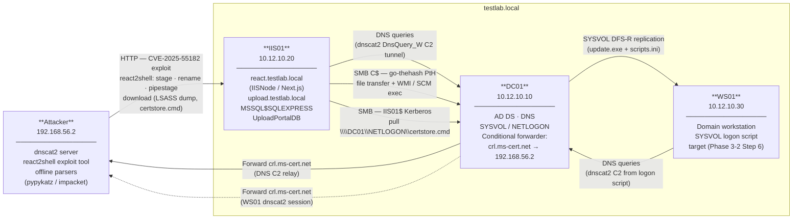
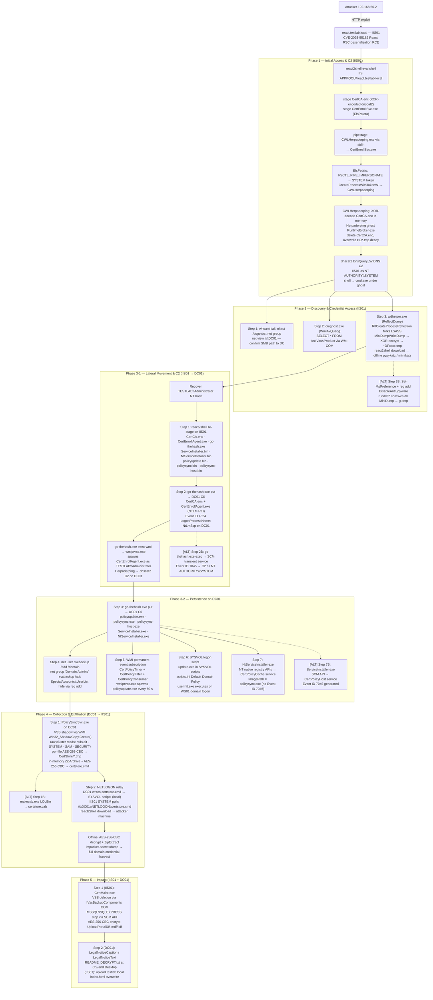

# IIS AppPool Escalation Path — Attack Flow Summary

## Overview

Server-side initial access via `react.testlab.local` on IIS01. The attacker exploits a React Server Components deserialization vulnerability (CVE-2025-55182) to achieve unauthenticated RCE as the IIS AppPool identity, escalates to `NT AUTHORITY\SYSTEM` via EfsPotato named-pipe impersonation, and establishes a DNS C2 session under a Herpaderping ghost `RuntimeBroker.exe`. From this SYSTEM foothold, the attacker dumps LSASS credentials, recovers the `TESTLAB\Administrator` NT hash, and performs Pass-the-Hash lateral movement to DC01. Four persistence mechanisms are installed on the Domain Controller. Credential material (ntds.dit + registry hives) is harvested via raw VSS volume reads, double-AES-256-CBC-encrypted, and exfiltrated over the existing react2shell HTTP channel. The path terminates with the ransomware impact sequence: VSS deletion, service stop, database encryption, logon banner modification, and web portal defacement.

**Entry point:** `react.testlab.local` on IIS01 (CVE-2025-55182, unauthenticated RCE)  
**Primary hosts:** IIS01 → DC01 (→ WS01 via SYSVOL logon script)  
**End state:** Full domain credential harvest exfiltrated; four persistence mechanisms on DC01; `UploadPortalDB` AES-256-CBC encrypted; domain logon screen defaced; upload portal web root overwritten

---

## Lab Environment

| Role | Hostname | IP | Notes |
| - | - | - | - |
| Domain Controller / DNS | DC01 | 10.12.10.10 | Hosts AD DS, DNS zone `testlab.local`, conditional forwarder for `crl.ms-cert.net` |
| IIS Server | IIS01 | 10.12.10.20 | Hosts `react.testlab.local` (IISNode/Next.js) and `upload.testlab.local`; SQL Server Express `MSSQL$SQLEXPRESS` with `UploadPortalDB` |
| Workstation | WS01 | 10.12.10.30 | Domain-joined; receives SYSVOL logon script from Phase 3-2 Step 6 |
| Attacker machine | Operator controlled | 192.168.56.2 | Runs dnscat2 server, react2shell exploit tool, offline credential parsers |

### Topology

---

## Attack Flow

---

## Phase Summary

| Phase | File(s) | Tactic | Key Behaviors |
| - | - | - | - |
| Phase 1 | `Phase 1.md` | Initial Access, Execution, Privilege Escalation, Defense Evasion, C2 | CVE-2025-55182 RCE → react2shell; `stage --encrypt` XOR-encodes dnscat2 payload (`CertCA.enc`, first byte `0xEE`); EfsPotato (`CertEnrollSvc.exe`) — `FSCTL_PIPE_IMPERSONATE` + `NtDuplicateToken` via indirect syscall trampolines → SYSTEM token; `CreateProcessWithTokenW` spawns CWLHerpaderping; Herpaderping ghost `RuntimeBroker.exe` — XOR-decode in-memory, `NtCreateSection(SEC_IMAGE)` + `NtCreateProcessEx`, overwrite `HD*.tmp` with IIS log decoy, PPID spoof to Session 0 `svchost.exe`/`wininit.exe`; dnscat2 DnsQuery_W C2 (UDP/53 socket held by `svchost.exe` Dnscache); `shell` → `cmd.exe` child of ghost |
| Phase 2 | `Phase 2.md` | Discovery, Credential Access, Exfiltration | Step 1: `whoami /all`, `nltest /dsgetdc:`, `net group`, `net user /domain`, `net view \\DC01` (recon + SMB path confirmation); Step 2: `WmiAvQuery.exe` (staged as `diaghost.exe`) — `IWbemLocator` → `SELECT * FROM AntiVirusProduct`; Step 3: `wdhelper.exe` (ReflectDump) — `EnumProcesses` + `QueryFullProcessImageNameW`, `RtlCreateProcessReflection` (`REFLECT_ACCESS` ~`0x4FA`), `MiniDumpWriteDump` via runtime-resolved `dbghelp.dll`, XOR-encrypt → `~DFxxxx.tmp`, react2shell `download` 8192-byte chunks; [ALT] Step 3B: `Set-MpPreference` + `reg add DisableAntiSpyware`, `rundll32 comsvcs.dll MiniDump` → `g.dmp` |
| Phase 3-1 | `Phase 3-1.md` | Lateral Movement, Execution, C2 | Step 1: react2shell re-stages 7 binaries to `C:\ProgramData\` on IIS01 (`CertCA.enc`, `CertEnrollAgent.exe`, `go-thehash.exe`, `ServiceInstaller.bin`, `NtServiceInstaller.bin`, `policyupdate.bin`, `policysync.bin`); Step 2: `go-thehash.exe put` transfers `CertCA.enc` + `CertEnrollAgent.exe` to DC01 `C$` via NTLM PtH (Event ID 4624 `NtLmSsp` on DC01); `go-thehash.exe exec-wmi` → `wmiprvse.exe` spawns `CertEnrollAgent.exe` as `TESTLAB\Administrator`; Herpaderping ghost + dnscat2 C2 on DC01 as Domain Admin; [ALT] Step 2B: `go-thehash.exe exec` → SCM transient service (Event ID 7045) → C2 as `NT AUTHORITY\SYSTEM` |
| Phase 3-2 | `Phase 3-2.md` | Persistence, Lateral Movement | Step 3: `go-thehash.exe put` bulk-stages 4 persistence binaries to DC01 `C$` (`.bin` on IIS01 → `.exe` on DC01); Step 4: `net user svcbackup /add /domain` + DA group (Security Events 4720, 4728) + `SpecialAccounts\UserList` hide (Sysmon 13); Step 5: WMI subscription — `CertPolicyTimer` + `CertPolicyFilter` + `CertPolicyConsumer` (Event ID 5861); Step 6: `policyupdate.exe` → `update.exe` in SYSVOL scripts, `scripts.ini` Default Domain Policy, `userinit.exe` triggers on WS01 domain logon; Step 7: `NtServiceInstaller.exe` — NT native registry APIs write `CertPolicyCache` service (no Event ID 7045); [ALT] Step 7B: `ServiceInstaller.exe` — SCM `CreateServiceW` → `CertPolicyHost` (Event ID 7045) |
| Phase 4 | `Phase 4.md` | Collection, Exfiltration | Step 1: `PolicySyncSvc.exe` — `Win32_ShadowCopy.Create()` via WMI, raw cluster reads (`FSCTL_GET_RETRIEVAL_POINTERS` + shadow volume device `ReadFile`, bypasses WdFilter.sys), per-file AES-256-CBC to `CertStore/*.tmp`, shadow deleted via WMI, in-memory `ZipArchive` + outer AES-256-CBC → `certstore.cmd` (batch-script-masked base64); [ALT] Step 1B: `makecab.exe /f certstore.ddf` → `certstore.cab`; Step 2: NETLOGON relay — DC01 writes `certstore.cmd` to SYSVOL scripts locally; IIS01 SYSTEM pulls `\\DC01\NETLOGON\certstore.cmd`; react2shell `download` exfiltrates via HTTP eval channel; offline: AES-CBC double-decrypt + `impacket-secretsdump` |
| Phase 5 | `Phase 5.md` | Impact | Step 1 (IIS01): `CertMaint.exe` — `IVssBackupComponents::DeleteSnapshots` via COM (no child process), `MSSQL$SQLEXPRESS` stop + restart via SCM API, AES-256-CBC in-place encrypt `UploadPortalDB.mdf`/`.ldf` via `CreateFileMappingW` + embedded tiny-AES-c; Step 2 (DC01): `Set-ItemProperty` → `LegalNoticeCaption`/`LegalNoticeText` ransom banner (domain-wide via GPO policy path), `README_DECRYPT.txt` at `C:\` and Administrator Desktop; (IIS01): `powershell.exe` SYSTEM writes ransom HTML to `C:\inetpub\upload.testlab.local\index.html` |

---

## Step-Level Reference

| Step | File | Host | Session | Behaviors |
| - | - | - | - | - |
| Step 1 | Phase 1.md | IIS01 | IIS APPPOOL\react.testlab.local → NT AUTHORITY\SYSTEM | CVE-2025-55182 eval shell; XOR-staged `CertCA.enc`; EfsPotato pipestage SYSTEM escalation; CWLHerpaderping ghost; dnscat2 DnsQuery_W C2 |
| Step 1 | Phase 2.md | IIS01 | NT AUTHORITY\SYSTEM | `whoami /all`, `nltest /dsgetdc:`, `net group "Domain Admins" /domain`, `net user /domain`, `net view \\DC01` |
| Step 2 | Phase 2.md | IIS01 | NT AUTHORITY\SYSTEM | `WmiAvQuery.exe` (staged as `diaghost.exe`) — WMI COM AV profiling |
| Step 3 | Phase 2.md | IIS01 | NT AUTHORITY\SYSTEM | `wdhelper.exe` LSASS reflection dump → XOR-encrypt `~DFxxxx.tmp` → react2shell exfil |
| [ALT] Step 3B | Phase 2.md | IIS01 | NT AUTHORITY\SYSTEM | Defender disable (`Set-MpPreference` + `reg add`) + `rundll32 comsvcs.dll MiniDump` → `g.dmp` |
| Step 1 | Phase 3-1.md | IIS01 | IIS APPPOOL\react.testlab.local | Re-stage 7 binaries to `C:\ProgramData\` on IIS01 via react2shell |
| Step 2 | Phase 3-1.md | IIS01 → DC01 | NT AUTHORITY\SYSTEM (IIS01) | PtH SMB file transfer + WMI execution; Herpaderping → dnscat2 C2 on DC01 as `TESTLAB\Administrator` |
| [ALT] Step 2B | Phase 3-1.md | IIS01 → DC01 | NT AUTHORITY\SYSTEM (IIS01) | PtH SCM transient service (Event ID 7045); dnscat2 C2 on DC01 as `NT AUTHORITY\SYSTEM` |
| Step 3 | Phase 3-2.md | IIS01 → DC01 | NT AUTHORITY\SYSTEM (IIS01) | Bulk PtH SMB transfer of persistence binaries to DC01 `C$` |
| Step 4 | Phase 3-2.md | DC01 | TESTLAB\Administrator | Domain backdoor account `svcbackup`; DA group membership; `SpecialAccounts\UserList` hide |
| Step 5 | Phase 3-2.md | DC01 | TESTLAB\Administrator | WMI permanent event subscription; 60 s timer triggers `policyupdate.exe` via `wmiprvse.exe` |
| Step 6 | Phase 3-2.md | DC01 → WS01 | TESTLAB\Administrator | SYSVOL logon script; `update.exe` staged; `scripts.ini` Default Domain Policy; `userinit.exe` executes on domain logon |
| Step 7 | Phase 3-2.md | DC01 | TESTLAB\Administrator | `NtServiceInstaller.exe` — native registry APIs create `CertPolicyCache` auto-start service (no Event ID 7045) |
| [ALT] Step 7B | Phase 3-2.md | DC01 | TESTLAB\Administrator | `ServiceInstaller.exe` — SCM `CreateServiceW` creates `CertPolicyHost` auto-start service (Event ID 7045) |
| Step 1 | Phase 4.md | DC01 | TESTLAB\Administrator | `PolicySyncSvc.exe` — VSS shadow, raw volume reads, per-file AES-256-CBC, in-memory ZipArchive + AES-256-CBC → `certstore.cmd` |
| [ALT] Step 1B | Phase 4.md | DC01 | TESTLAB\Administrator | `makecab.exe /f certstore.ddf` → `certstore.cab` |
| Step 2 | Phase 4.md | DC01 + IIS01 | TESTLAB\Administrator (DC01) / NT AUTHORITY\SYSTEM (IIS01) | NETLOGON relay staging; IIS01 pulls via machine account Kerberos; react2shell HTTP exfil; offline AES decrypt + `impacket-secretsdump` |
| Step 1 | Phase 5.md | IIS01 | NT AUTHORITY\SYSTEM | `CertMaint.exe` — VSS deletion (COM `IVssBackupComponents`), MSSQL service stop via SCM, AES-256-CBC encrypt `.mdf`/`.ldf` |
| Step 2 | Phase 5.md | DC01 + IIS01 | TESTLAB\Administrator (DC01) / NT AUTHORITY\SYSTEM (IIS01) | Logon banner registry write (`LegalNoticeCaption`/`LegalNoticeText`); ransom notes on DC01; upload portal web root HTML overwrite |

---

## Key Payloads

| Payload | Location | Used In |
| - | - | - |
| `svcmgr.exe` (dnscat2 `cmd/dnscat-dnsapi`) | `resources/payloads/rce-and-c2/dnscat2/go-client/` | Phase 1 Step 1 — staged as `CertCA.enc` (XOR-encrypted) |
| `CertEnrollSvc.exe` (EfsPotato) | `resources/payloads/priv-escalation/EfsPotato/` | Phase 1 Step 1 — SYSTEM escalation via named-pipe impersonation |
| `CWLHerpaderping.exe` | `resources/payloads/process-injection/CWLHerpaderping/x64/Release/` | Phase 1 Step 1 — ghost process loader |
| `WmiAvQuery.exe` | `resources/payloads/WmiAvQuery/` | Phase 2 Step 2 — staged as `diaghost.exe` |
| `ReflectDump.exe` → `wdhelper.gz` | `resources/payloads/cred-access/LsassReflectDumping/` | Phase 2 Step 3 — staged as `wdhelper.exe` |
| `dnscat2.exe` (`cmd/dnscat-dnsapi`) | `resources/payloads/rce-and-c2/dnscat2/go-client/` | Phase 3-1 Step 1 — staged as `policyupdate.bin`, `CertCA.enc` |
| `policysync.exe` / `policysync-host.exe` (`cmd/dnsapi-service`) | `resources/payloads/rce-and-c2/dnscat2/go-client/` | Phase 3-1 Step 1 — staged as `policysync.bin`, `policysync-host.bin` |
| `go-thehash.exe` | `resources/payloads/lateral-movement/go-thehash/` | Phase 3-1 Steps 1–2, Phase 3-2 Step 3 — PtH SMB/WMI/SCM |
| `CertEnrollAgent.exe` (CWLHerpaderping, same build as Phase 1) | `resources/payloads/process-injection/CWLHerpaderping/x64/Release/` | Phase 3-1 Step 1 — re-staged for DC01 lateral movement |
| `ServiceInstaller.exe` | `resources/payloads/persistence/windows-service/advapi32-cpp/` | Phase 3-2 Step 7B — SCM API service creation |
| `NtServiceInstaller.exe` | `resources/payloads/persistence/windows-service/syscalls-cpp/` | Phase 3-2 Step 7 — NT native registry service creation |
| `PolicySyncSvc.exe` (NtdsRawDump) | `resources/payloads/cred-access/NtdsRawDump/` | Phase 4 Step 1 — VSS + raw volume reads + AES archive |
| `CertMaint.exe` (ImpactPayload) | `resources/payloads/impact/ImpactPayload/` | Phase 5 Step 1 — VSS deletion + service stop + AES file encryption |
