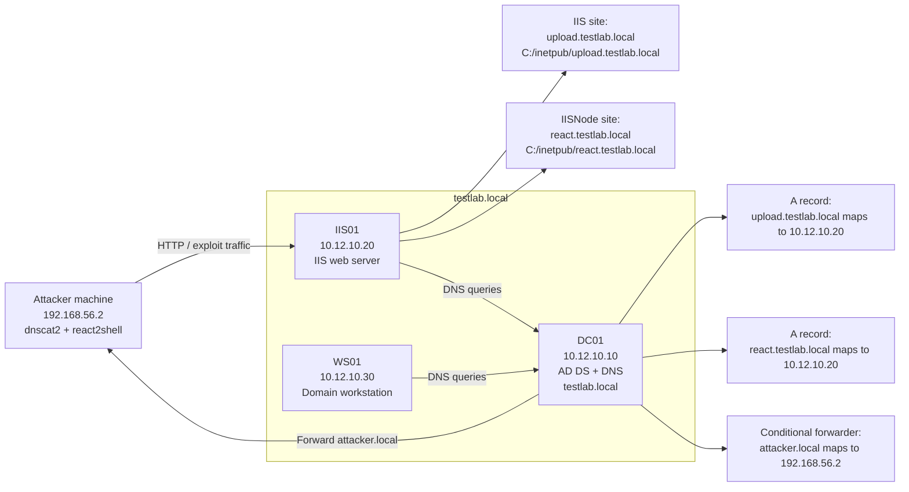
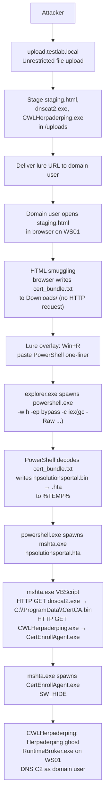
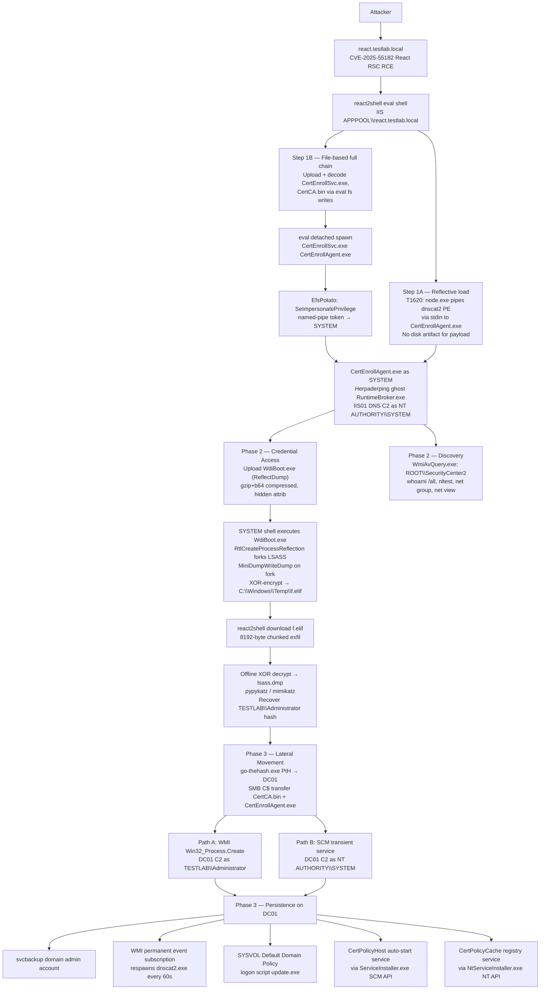

# Attack Flow Summary

## Overview

This scenario models a Windows enterprise intrusion through two independent
attack paths that both target `IIS01`. The two paths are run separately and
cover different entry points, techniques, and host contexts. They share the
same lab environment and the same post-exploitation chain once a SYSTEM C2
session is established on `IIS01`.

- **[`html-smuggling-path/`](html-smuggling-path/Plan.md)** — user-driven
  initial access via `upload.testlab.local`. The attacker abuses unrestricted
  file upload to host a malicious HTML lure. A domain user on `WS01` opens the
  page, receives `cert_bundle.txt` via HTML smuggling, executes the copy-paste
  PowerShell chain, and launches an HTA dropper that downloads dnscat2 and the
  Herpaderping loader and establishes DNS C2 from the workstation. This path
  ends with a C2 session on `WS01` as the domain user.

- **[`iis-apppool-escalation-path/`](iis-apppool-escalation-path/Phase%201.md)**
  — server-side initial access via `react.testlab.local`. The attacker exploits
  a React Server Components deserialization vulnerability (CVE-2025-55182) to
  achieve unauthenticated RCE on `IIS01` as the AppPool identity, escalates to
  `NT AUTHORITY\SYSTEM` via EfsPotato, and establishes DNS C2 through
  Herpaderping and dnscat2. From this SYSTEM session the attacker dumps LSASS,
  recovers the `TESTLAB\Administrator` NT hash, performs Pass the Hash to
  `DC01`, and installs multiple independent persistence mechanisms on the Domain
  Controller.

## Lab Environment

The lab is a Windows Server 2022 Active Directory environment under the
`testlab.local` domain. `DC01` is the Domain Controller and DNS server. `IIS01`
hosts both vulnerable web applications through IIS virtual hosts. `WS01` is the
domain-joined workstation used for the user-driven execution path.

| Role | Hostname | IP | Notes |
| - | - | - | - |
| Domain Controller / DNS | `DC01` | `10.12.10.10` | Hosts AD DS, DNS zone `testlab.local`, and conditional forwarder for `attacker.local` |
| IIS Server | `IIS01` | `10.12.10.20` | Hosts `upload.testlab.local` and `react.testlab.local` |
| Workstation | `WS01` | `10.12.10.30` | Domain-joined workstation used by the victim domain user |
| Attacker machine | Operator controlled | `192.168.56.2` | Runs dnscat2 server and exploit tooling; receives DNS tunnel traffic for `attacker.local` |

### Lab Topology

## Path 1 — HTML Smuggling (User-Driven)

**Files:** [`html-smuggling-path/Phase 1.md`](html-smuggling-path/Phase 1.md),
[`html-smuggling-path/Cleanup.md`](html-smuggling-path/Cleanup.md)

**Entry point:** `upload.testlab.local` on `IIS01`  
**Primary host:** `WS01` (domain workstation)  
**End state:** dnscat2 DNS C2 on `WS01` as domain user, via Herpaderping ghost `RuntimeBroker.exe`

### Attack Flow

### Step Summary

| Step | Tactic | Key Behavior |
| - | - | - |
| Step 1 | Initial Access, Defense Evasion | Unrestricted file upload stages lure and payloads; HTML smuggling delivers `cert_bundle.txt` via in-page base64 blob (T1027.006) |
| Step 2 | Execution, C2 | User executes Win+R PowerShell paste (T1204.004); PowerShell decodes HTA (T1140, T1036.008) and launches `mshta.exe` (T1218.005); HTA VBScript downloads payloads over HTTP (T1105, T1071.001) and spawns Herpaderping loader |

---

## Path 2 — IIS AppPool Escalation (Server-Side)

**Files:** [`iis-apppool-escalation-path/Phase 1.md`](iis-apppool-escalation-path/Phase%201.md),
[`iis-apppool-escalation-path/Phase 2.md`](iis-apppool-escalation-path/Phase%202.md),
[`iis-apppool-escalation-path/Phase 3.md`](iis-apppool-escalation-path/Phase%203.md),
[`iis-apppool-escalation-path/Cleanup.md`](iis-apppool-escalation-path/Cleanup.md)

**Entry point:** `react.testlab.local` on `IIS01`  
**Primary hosts:** `IIS01` → `DC01`  
**End state:** dnscat2 DNS C2 on `DC01`; five persistence mechanisms installed

### Attack Flow

### Phase Summary

| Phase | File | Tactic | Key Behaviors |
| - | - | - | - |
| Phase 1 | `Phase 1.md` | Initial Access, Privilege Escalation, Defense Evasion, C2 | CVE-2025-55182 RCE → react2shell; Step 1A T1620 reflective load (no disk artifact); Step 1B EfsPotato token impersonation → SYSTEM; Herpaderping ghost process; dnscat2 DNS C2 |
| Phase 2 | `Phase 2.md` | Credential Access, Discovery | ReflectDump via `RtlCreateProcessReflection`; XOR-encrypted `f.elif`; chunked exfil; offline decrypt; WMI AV query; domain recon |
| Phase 3 | `Phase 3.md` | Lateral Movement, Execution, Persistence | Pass the Hash via `go-thehash.exe`; WMI + SCM dual-path execution on DC01; 5 independent persistence mechanisms |

## Key Hosts

| Host | Role |
| - | - |
| Attacker machine | Runs dnscat2 server, react2shell, payload encoding, and LSASS dump parsing |
| IIS01 / `upload.testlab.local` | File-upload staging for the workstation path |
| IIS01 / `react.testlab.local` | React RCE, SYSTEM foothold, LSASS dump source, and PtH launch point |
| WS01 / victim workstation | User-driven execution and logon-script target |
| DC01 | Domain Controller, lateral movement target, and persistence anchor |
