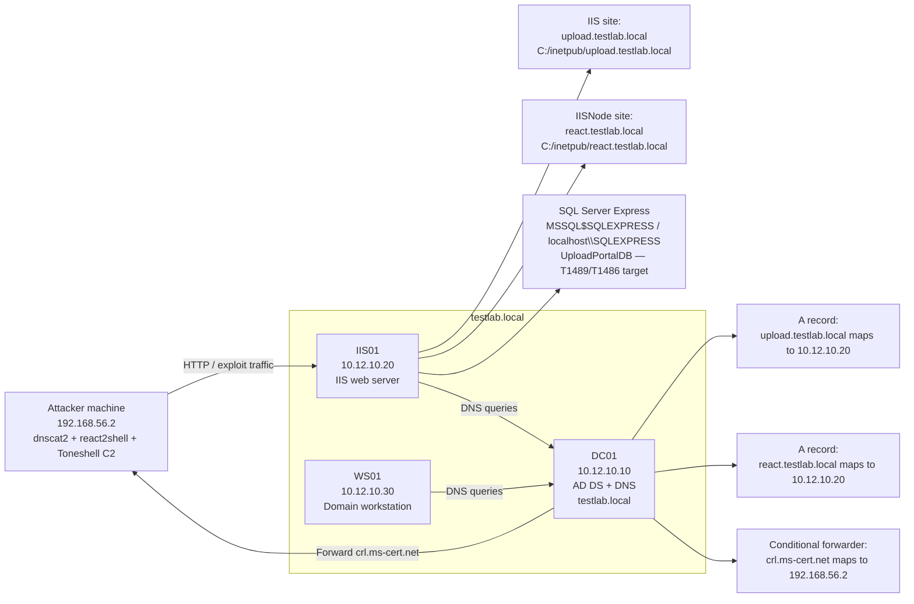
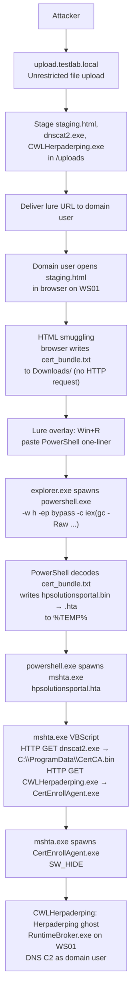
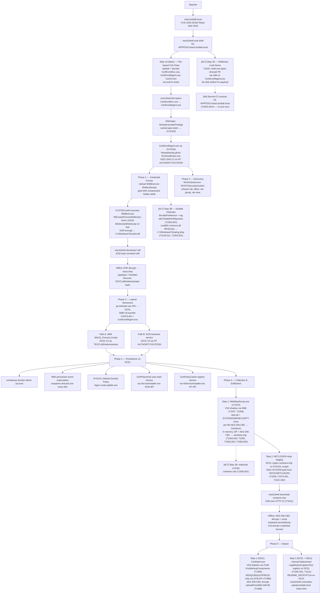

```mermaid
flowchart TD
    A["Attacker"] --> B["upload.testlab.local<br/>Unrestricted file upload"]
    B --> C["Stage update.html + Important_Update.rar<br/>in /uploads<br/>(RAR: Update.lnk + EssosUpdate.exe + wsdapi.dll)"]
    C --> D["Deliver lure URL to domain user<br/>via spearphishing link (T1566.002)"]
    D --> E["Domain user opens update.html<br/>in browser on WS01 (T1189)"]
    E --> F["User downloads Important_Update.rar<br/>password-protected (T1027.013)<br/>extracts with password 'infected'"]
    F --> G["User double-clicks Update.lnk<br/>explorer.exe spawns EssosUpdate.exe (T1204.002)"]
    G --> H["EssosUpdate.exe sideloads wsdapi.dll<br/>TONESHELL loader (T1574.001)"]
    H --> I["wsdapi.dll: anti-analysis checks<br/>foreground window + process name (T1497, T1622)"]
    I --> J["wsdapi.dll spawns regsvr32.exe /s<br/>re-registers itself (T1218.010)"]
    J --> K["regsvr32.exe spawns waitfor.exe<br/>then mavinject.exe injects wsdapi.dll<br/>into waitfor.exe (T1218.013)"]
    K --> L["waitfor.exe: XOR-decrypt embedded shellcode<br/>reflective load (T1140, T1620)"]
    L --> M["waitfor.exe: discover computer name<br/>generate GUID, connect to C2<br/>192.168.56.2:443 TCP (T1095)"]
```

# Attack Flow Summary

## Overview

This scenario models a Windows enterprise intrusion through three independent
attack paths that all target `IIS01`. The three paths are run separately and
cover different entry points, techniques, and host contexts. They share the
same lab environment and the same post-exploitation chain once a SYSTEM C2
session is established on `IIS01`.

- **[`html-smuggling-path/`](html-smuggling-path/Phase%201.md)** — user-driven
  initial access via `upload.testlab.local`. The attacker abuses unrestricted
  file upload to host a malicious HTML lure. A domain user on `WS01` opens the
  page, receives `cert_bundle.txt` via HTML smuggling, executes the copy-paste
  PowerShell chain, and launches an HTA dropper that downloads dnscat2 and the
  Herpaderping loader and establishes DNS C2 from the workstation. This path
  ends with a C2 session on `WS01` as the domain user.

- **[`toneshell-path/`](toneshell-path/Phase%201.md)** — user-driven initial
  access via `upload.testlab.local`. The attacker hosts a fake update lure page
  that delivers a password-protected RAR archive. A domain user on `WS01`
  downloads and extracts the archive, executes the embedded LNK shortcut, and
  triggers DLL sideloading of the Toneshell backdoor into `waitfor.exe` via
  `regsvr32.exe` and `mavinject.exe`, establishing TCP C2 to the attacker
  machine. This path ends with a Toneshell C2 session on `WS01` as the domain
  user.

- **[`iis-apppool-escalation-path/`](iis-apppool-escalation-path/Phase%201.md)**
  — server-side initial access via `react.testlab.local`. The attacker exploits
  a React Server Components deserialization vulnerability (CVE-2025-55182) to
  achieve unauthenticated RCE on `IIS01` as the AppPool identity, escalates to
  `NT AUTHORITY\SYSTEM` via EfsPotato, and establishes DNS C2 through
  Herpaderping and dnscat2. From this SYSTEM session the attacker dumps LSASS,
  recovers the `TESTLAB\Administrator` NT hash, performs Pass the Hash to
  `DC01`, installs multiple independent persistence mechanisms on the Domain
  Controller, then collects credential material and web configuration files,
  archives them via three independent methods, and exfiltrates via the
  react2shell HTTP channel. After exfiltration, the attacker executes the
  destructive final phase: stops services, deletes Volume Shadow Copies and
  backup catalogs, disables Windows Recovery Console, defaces both the DC01
  logon screen and the IIS01 web portal, encrypts files in a scoped test
  directory using AES-256-CBC, and forces a reboot of IIS01 — modelling the
  double-extortion ransomware termination sequence.

## Lab Environment

The lab is a Windows Server 2022 Active Directory environment under the
`testlab.local` domain. `DC01` is the Domain Controller and DNS server. `IIS01`
hosts both vulnerable web applications through IIS virtual hosts. `WS01` is the
domain-joined workstation used for the user-driven execution paths.

| Role | Hostname | IP | Notes |
| - | - | - | - |
| Domain Controller / DNS | `DC01` | `10.12.10.10` | Hosts AD DS, DNS zone `testlab.local`, and conditional forwarder for `crl.ms-cert.net` |
| IIS Server | `IIS01` | `10.12.10.20` | Hosts `upload.testlab.local` and `react.testlab.local`; SQL Server Express instance `MSSQL$SQLEXPRESS` (`localhost\SQLEXPRESS`) with database `UploadPortalDB` — T1489/T1486 target in Phase 5; data files at `C:\Program Files\Microsoft SQL Server\MSSQL17.SQLEXPRESS\MSSQL\DATA\` |
| Workstation | `WS01` | `10.12.10.30` | Domain-joined workstation used by the victim domain user |
| Attacker machine | Operator controlled | `192.168.56.2` | Runs dnscat2 server and exploit tooling; receives DNS tunnel traffic for `crl.ms-cert.net` and Toneshell TCP C2 |

### Lab Topology

## Path 1 — HTML Smuggling (User-Driven)

**Files:** [`html-smuggling-path/Phase 1.md`](html-smuggling-path/Phase 1.md),
[`html-smuggling-path/Cleanup.md`](html-smuggling-path/Cleanup.md)

**Entry point:** `upload.testlab.local` on `IIS01`  
**Primary host:** `WS01` (domain workstation)  
**End state:** dnscat2 DNS C2 on `WS01` as domain user, via Herpaderping ghost `RuntimeBroker.exe`

### Attack Flow

### Step Summary

| Step | Tactic | Key Behavior |
| - | - | - |
| Step 1 | Initial Access, Defense Evasion | Unrestricted file upload stages lure and payloads; HTML smuggling delivers `cert_bundle.txt` via in-page base64 blob (T1027.006) |
| Step 2 | Execution, C2 | User executes Win+R PowerShell paste (T1204.004); PowerShell decodes HTA (T1140, T1036.008) and launches `mshta.exe` (T1218.005); HTA VBScript downloads payloads over HTTP (T1105, T1071.001) and spawns Herpaderping loader |

---

## Path 2 — Toneshell Sideloading (User-Driven)

**Files:** [`toneshell-path/Phase 1.md`](toneshell-path/Phase%201.md)

**Entry point:** `upload.testlab.local` on `IIS01`  
**Primary host:** `WS01` (domain workstation)  
**End state:** Toneshell TCP C2 on `WS01` as domain user, via `waitfor.exe` shellcode injection

### Attack Flow

### Step Summary

| Step | Tactic | Key Behavior |
| - | - | - |
| Step 1 | Initial Access, Defense Evasion, Execution, C2 | Drive-by lure delivers password-protected RAR (T1027.013); LNK shortcut launches renamed legitimate binary (T1204.002); DLL sideloading loads Toneshell (T1574.001); `regsvr32.exe` proxy execution (T1218.010); `mavinject.exe` injection into `waitfor.exe` (T1218.013); XOR-decrypt and reflective shellcode load (T1140, T1620); TCP C2 (T1095) |

---

## Path 3 — IIS AppPool Escalation (Server-Side)

**Files:** [`iis-apppool-escalation-path/Phase 1.md`](iis-apppool-escalation-path/Phase%201.md),
[`iis-apppool-escalation-path/Phase 2.md`](iis-apppool-escalation-path/Phase%202.md),
[`iis-apppool-escalation-path/Phase 3.md`](iis-apppool-escalation-path/Phase%203.md),
[`iis-apppool-escalation-path/Phase 4.md`](iis-apppool-escalation-path/Phase%204.md),
[`iis-apppool-escalation-path/Phase 5.md`](iis-apppool-escalation-path/Phase%205.md),
[`iis-apppool-escalation-path/Cleanup.md`](iis-apppool-escalation-path/Cleanup.md)

**Entry point:** `react.testlab.local` on `IIS01`  
**Primary hosts:** `IIS01` → `DC01`  
**End state:** dnscat2 DNS C2 on `DC01`; four persistence mechanisms installed (svcbackup account, WMI subscription, SYSVOL logon script, registry-backed service); NTDS credential material exfiltrated; VSS shadow copies deleted, `MSSQL$SQLEXPRESS` stopped, `UploadPortalDB` AES-256-CBC encrypted on IIS01; domain logon screen and `upload.testlab.local` web portal defaced

### Attack Flow

### Phase Summary

| Phase | File | Tactic | Key Behaviors |
| - | - | - | - |
| Phase 1 | `Phase 1.md` | Initial Access, Execution, Privilege Escalation, Defense Evasion, C2 | CVE-2025-55182 RCE → react2shell; Step 1A EfsPotato token impersonation → SYSTEM (main); [ALT] Step 1B T1620 reflective load via stdin (no disk artifact); Herpaderping ghost process; dnscat2 DNS C2; `shell` command spawns `cmd.exe` under ghost `RuntimeBroker.exe` (T1059.003) |
| Phase 2 | `Phase 2.md` | Credential Access, Discovery | ReflectDump via `RtlCreateProcessReflection`; XOR-encrypted `f.elif`; chunked exfil; offline decrypt; WMI AV query; domain recon; [ALT] Step 3B: Defender disable (T1562.001) + `rundll32 comsvcs.dll MiniDump` (T1218.011, T1003.001) → `g.dmp` |
| Phase 3 | `Phase 3.md` | Lateral Movement, Execution, Persistence | Pass the Hash via `go-thehash.exe`; WMI + SCM dual-path execution on DC01; 4 persistence mechanisms: svcbackup account, WMI subscription, SYSVOL logon script, registry-backed service (+ API-based service variant) |
| Phase 4 | `Phase 4.md` | Collection, Exfiltration | `NtdsRawDump.exe`: VSS shadow via WMI (T1047), direct volume access (T1006), NTDS harvest (T1003.003, T1005), automated collection (T1119), in-memory ZIP + AES-256-CBC double encryption (T1560.002, T1560.003); [ALT] `makecab` LOLBin (T1560.001); NETLOGON relay staging (T1039, T1074.001, T1021.002); exfil via react2shell HTTP C2 (T1041) |
| Phase 5 | `Phase 5.md` | Impact | `CertMaint.exe` (single binary): VSS deletion via COM `IVssBackupComponents` (T1490); `MSSQL$SQLEXPRESS` stop via SCM API (T1489); AES-256-CBC encrypt `UploadPortalDB.mdf`/`.ldf` on IIS01 (T1486); logon-screen registry modification and ransom notes on DC01 + `upload.testlab.local` web root overwrite (T1491.001, T1112) |

## Key Hosts

| Host | Role |
| - | - |
| Attacker machine | Runs dnscat2 server, react2shell, Toneshell C2, payload encoding, and LSASS dump / NTDS parsing |
| IIS01 / `upload.testlab.local` | File-upload staging for both workstation paths (HTML smuggling and Toneshell) |
| IIS01 / `react.testlab.local` | React RCE, SYSTEM foothold, LSASS dump source, PtH launch point, and exfil staging for collection archive |
| WS01 / victim workstation | User-driven execution for both Path 1 (HTML smuggling) and Path 2 (Toneshell sideloading); logon-script target |
| DC01 | Domain Controller, lateral movement target, persistence anchor, and collection source (NTDS + hives) |
