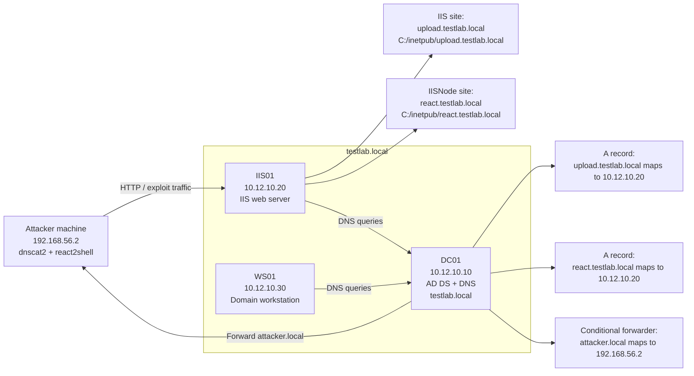
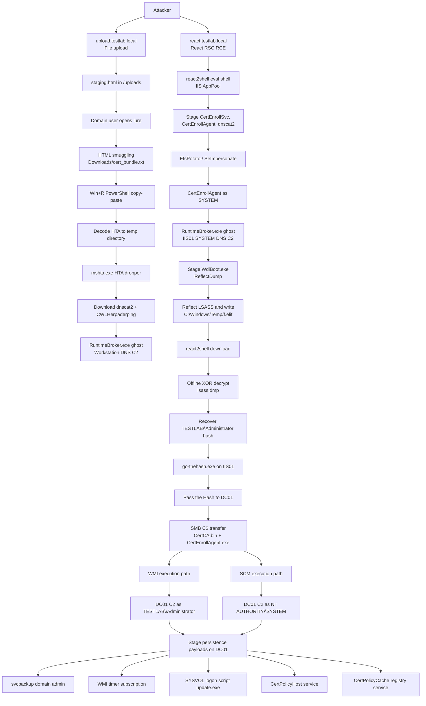

# Attack Flow Summary - Through Phase 3

## Overview

This scenario models a Windows enterprise intrusion through two parallel entry
paths against IIS01:

- `upload.testlab.local`: the attacker abuses unrestricted file upload to host
  `staging.html`. A domain user opens the lure, receives `cert_bundle.txt` via
  HTML smuggling, executes the copy-paste PowerShell chain, launches an HTA
  dropper, downloads dnscat2 and the Herpaderping loader, and establishes DNS C2
  from the workstation.
- `react.testlab.local`: the attacker exploits React Server Components RCE
  (CVE-2025-55182), stages payloads through react2shell, escalates to SYSTEM with
  EfsPotato, and establishes DNS C2 from IIS01 through Herpaderping and dnscat2.

From the IIS01 SYSTEM C2 session, the attacker dumps LSASS, recovers the
`TESTLAB\Administrator` NT hash, performs Pass the Hash to DC01, establishes C2
on the Domain Controller, and installs multiple independent persistence
mechanisms.

## Lab Environment

The lab is a Windows Server 2022 Active Directory environment under the
`testlab.local` domain. `DC01` is the Domain Controller and DNS server. `IIS01`
hosts both vulnerable web applications through IIS virtual hosts. `WS01` is the
domain-joined workstation used for the user-driven execution path.

| Role | Hostname | IP | Notes |
| - | - | - | - |
| Domain Controller / DNS | `DC01` | `10.12.10.10` | Hosts AD DS, DNS zone `testlab.local`, and conditional forwarder for `attacker.local` |
| IIS Server | `IIS01` | `10.12.10.20` | Hosts `upload.testlab.local` and `react.testlab.local` |
| Workstation | `WS01` | `10.12.10.30` | Domain-joined workstation used by the victim domain user |
| Attacker machine | Operator controlled | `192.168.56.2` | Runs dnscat2 server and exploit tooling; receives DNS tunnel traffic for `attacker.local` |

### Lab Topology

## Attack Flow

## Phase Breakdown

| Phase | Objective | Main Result |
| - | - | - |
| Phase 1 | Initial access, execution, and C2 | Workstation DNS C2 as a domain user; IIS01 DNS C2 as SYSTEM |
| Phase 2 | Credential access and discovery | LSASS dump exfiltrated and decrypted; `TESTLAB\Administrator` hash recovered |
| Phase 3 | Lateral movement and persistence | DC01 reached via Pass the Hash; C2 and persistence established on the Domain Controller |

## Main Behavior Chain

1. The attacker stages the lure and payloads through `upload.testlab.local`.
2. A workstation user executes the PowerShell copy-paste chain, which launches an
   HTA, downloads payloads, and creates dnscat2 DNS C2 through a Herpaderping
   ghost process.
3. In parallel, the attacker exploits `react.testlab.local`, stages payloads
   through react2shell, escalates with EfsPotato, and creates SYSTEM dnscat2 DNS
   C2 on IIS01.
4. The attacker uploads and runs `WdiBoot.exe` on IIS01 to create an
   XOR-encrypted LSASS dump (`f.elif`), downloads it, decrypts it to
   `lsass.dmp`, and extracts credential material.
5. The attacker uses the recovered `TESTLAB\Administrator` NT hash with
   `go-thehash.exe` to authenticate to DC01 over NTLM and transfer payloads over
   `C$`.
6. The attacker executes payloads on DC01 through two paths:
   - WMI `Win32_Process.Create`: C2 as `TESTLAB\Administrator`.
   - SCM transient service: C2 as `NT AUTHORITY\SYSTEM`.
7. The attacker installs persistence on DC01:
   - `svcbackup` domain admin account.
   - WMI permanent event subscription running `C:\ProgramData\dnscat2.exe`.
   - Default Domain Policy logon script running SYSVOL `update.exe`.
   - `CertPolicyHost` auto-start service via `ServiceInstaller.exe`.
   - `CertPolicyCache` registry-backed service via `NtServiceInstaller.exe`.

## Key Hosts

| Host | Role |
| - | - |
| Attacker machine | Runs dnscat2 server, react2shell, payload encoding, and LSASS dump parsing |
| IIS01 / `upload.testlab.local` | File-upload staging for the workstation path |
| IIS01 / `react.testlab.local` | React RCE, SYSTEM foothold, LSASS dump source, and PtH launch point |
| WS01 / victim workstation | User-driven execution and logon-script target |
| DC01 | Domain Controller, lateral movement target, and persistence anchor |
